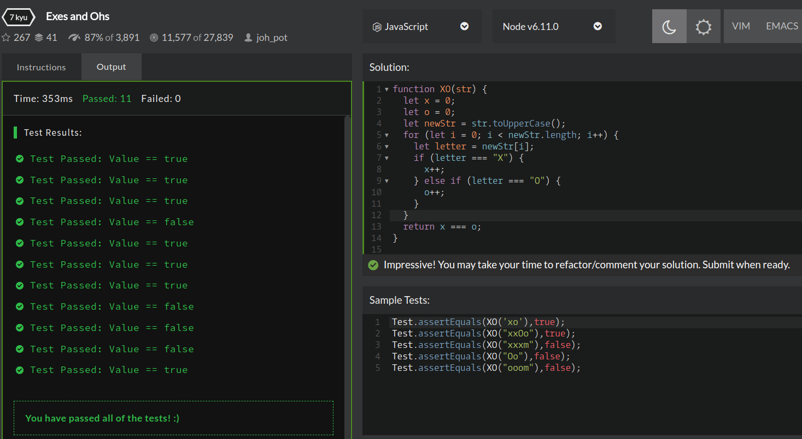

## CodeWars Challenge- 4

Check to see if a string has the same amount of 'x's and 'o's. The method must return a boolean and be case insensitive. The string can contain any char.

*Examples Given:*

input/output:

1. XO("ooxx") => true

2. XO("xooxx") => false

3. XO("ooxXm") => true

4. XO("zpzpzpp") => true // when no 'x' and 'o' is present should return true

5. XO("zzoo") => false

## Languages Used

1. JavaScript

## My solution:
This CodeWars challenge was a fun one. I right away knew I could use either the toUpperCase or toLowerCase method on the string being passed in, in order to make the test *case insensitive*. I place my case insensitive string in a new variable and then loop through each letter in the string with a for loop. Each letter is then evaluated, if the boolean value returned is true while checking for an "x" or an "o" then the count for that letter will increment. Once each letter being passed in has been evaluated my function checks if the count for exes and ohs is equal and returns the boolean value.
